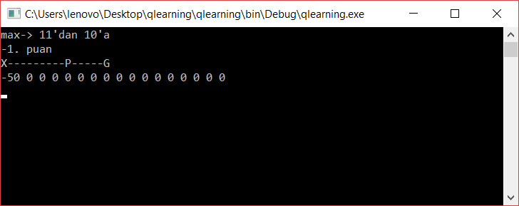
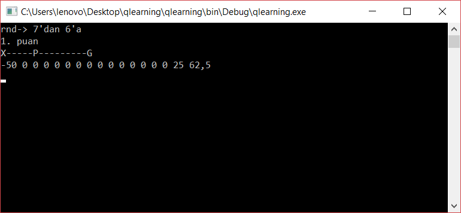
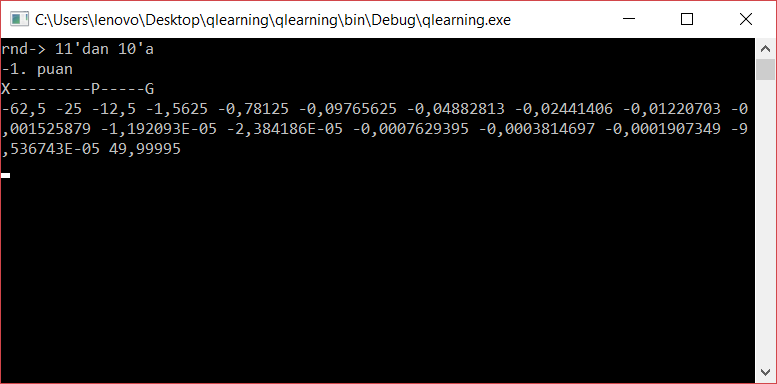
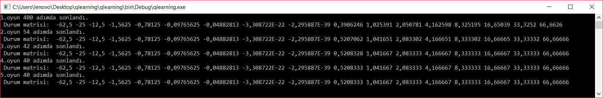

# Peynir Arayan Fare Oyunu (Q Learning Uygulaması)

16 bitlik bir hat üzerinde başlangıç noktası 8.indis olacak şekilde bir fare simüle edilmiştir. 0 noktasında kapan 16. indiste ise peynir bulunmaktadır. Eğer kapana giderse puan 1 azalacak peynire giderse puan 1 artacaktır. Puan 5 olduğunda oyun kazanılmış olur. -5 puanda ise oyun kaybedilmiş olur. Karakterin oyunu öğrenmesi ve yollara ağırlık vermesi için oyun 5 kere tekrarlanmaktadır. Karakter ilk oyunda deneme yanılmayla çıkışlardan birine şans eseri uğramaktadır. Kapana uğrarsa yolu negatif değerlerle dolduracaktır. Peynire uğrarsa ödül mantığıyla pozitif katsayıları içerecektir. Her oyunda peynirin yerini bulması ve yolu ezberlemesinin arttığını göreceksiniz.

Bu uygulama; [Teaching an AI to play a simple game using Q-learning](https://www.practicalai.io/teaching-ai-play-simple-game-using-q-learning/ ) 
sitesinin bir uygulamasıdır.

##### Negatif tarafa rasgele yöneldi

#### Positive tarafa rasgele yöneldi.

#### 1.Bölümün sonu

#### 5 Bölüm sonrası son durum ve bitirme süreleri

